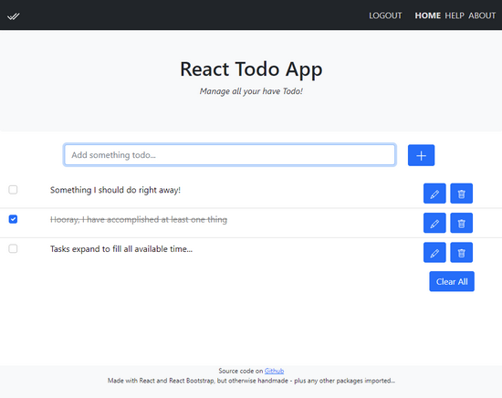

# React Todo Task Manager App

It seems everyone writes a Todo / Task Manager app when learning React - this is a one of those, created using Create React App and using Hooks.

This version is generally based on the [Vanilla JavaScript Todo / Task Manager app](https://github.com/sansbacher/todo-task-manager), but requires the API to function. I did keep the version just before integrating the API code, so you can reference the [LocalStorage Version](https://github.com/sansbacher/react-todo-app/tree/main/_SAVE%20LocalStorage-Based) if you want.

To see the evolution of the app as it was built you can clone this repo and then checkout one of the commits using the Commit Hash. You can see them with `git log --oneline` and checkout one of them with the hash, such as: `git checkout 3db2915`

Here is a table of commits:

Commit Hash | What you will find
------------|-------------------
f01a909 | Adjusted app to be served from a sub-path, not the webroot
047c7d6 | Added API functionality for Deleting Tasks
ed69ac6 | Added API functionality for Get Tasks and Add Task
14a844a | Added API for login, register, and logout functions
3db2915 | Added skeletal Login and Register pages. Final before adding API
b08ebb8 | Refactored for Context/useContext instead of prop-drilling
cad304b | Refactored for useReducer instead of useState
0169d23 | Added React-Bootstrap, including Modal, and styled
20a8437 | Added React Router and sample navigation pages
f960d1b | Added basic LocalStorage save/restore
3fba159 | Working as DOM-based, no styles or persistence
c1c06d8 | Initial static app skeleton - main page
abd96d6 | Ready to start React Todo App, LocalStorage based
c1810f1 | Initialize project using Create React App

The style/look is from [React Bootstrap](https://react-bootstrap.github.io/) - pretty plain. I didn't add the Profile management, but has Register and Login obviously (it uses the same login as the [Vanilla JS version](https://sansbacher-task-manager.herokuapp.com/) so you can modify your profile there). All the basic CRUD functions are present: adding, deleting, updating, and viewing Tasks. But not the "extra" stuff like sorting, pagination, etc.

I mainly use this to test and try-out new modules or methods, and leave them as a reminder for myself.

The React App should work in any modern browser, like Chrome, Opera Chromium, or Firefox - even Chrome on Android or Safari on iOS. It can't be used with Internet Explorer, but then neither should you.  

There is a **LIVE** version hosted on Heroku: [API-Based React Todo App](https://sansbacher-task-manager.herokuapp.com/API-React-Based/)

I hope this is useful for someone!
